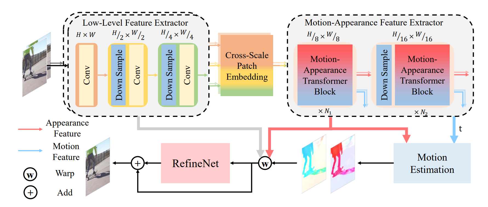
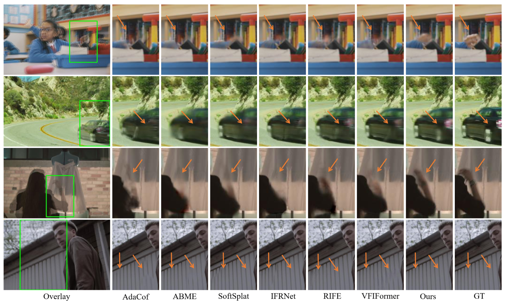
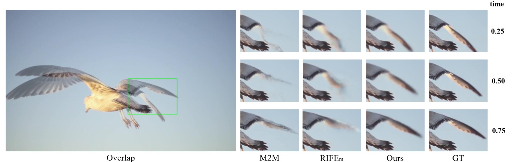
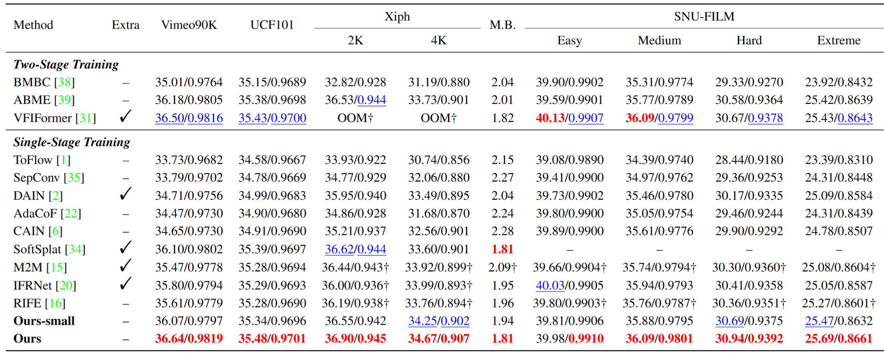
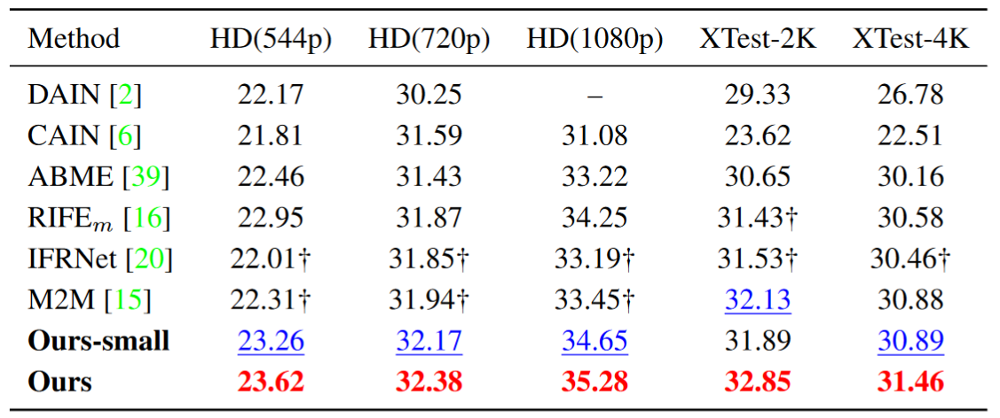
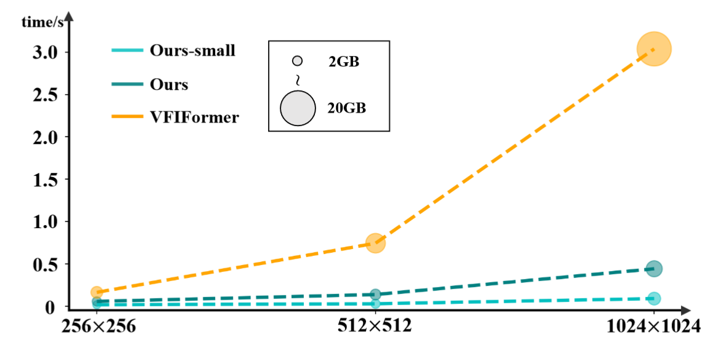

# Extracting Motion and Appearance via Inter-Frame Attention for Efficient Video Frame Interpolation [arxiv](https://arxiv.org/abs/2303.00440v1)

> [**Extracting Motion and Appearance via Inter-Frame Attention for Efficient Video Frame Interpolation**](https://arxiv.org/abs/2203.16507)<br>
> accept to **CVPR 2023**<br>
> [Guozhen Zhang](https://github.com/GuozhenZhang1999), [Yuhan Zhu](https://github.com/Breeze-zyuhan), [Haonan Wang](https://github.com/haonanwang0522), Youxin Chen, [Gangshan Wu](http://mcg.nju.edu.cn/member/gswu/en/index.html), [Limin Wang](http://wanglimin.github.io/)

[](https://paperswithcode.com/sota/video-frame-interpolation-on-vimeo90k?p=extracting-motion-and-appearance-via-inter)
[](https://paperswithcode.com/sota/video-frame-interpolation-on-ucf101-1?p=extracting-motion-and-appearance-via-inter)
[](https://paperswithcode.com/sota/video-frame-interpolation-on-xiph-4k-1?p=extracting-motion-and-appearance-via-inter)
[](https://paperswithcode.com/sota/video-frame-interpolation-on-xiph-2k?p=extracting-motion-and-appearance-via-inter)
[](https://paperswithcode.com/sota/video-frame-interpolation-on-x4k1000fps-2k?p=extracting-motion-and-appearance-via-inter)
[](https://paperswithcode.com/sota/video-frame-interpolation-on-x4k1000fps?p=extracting-motion-and-appearance-via-inter)

<div align="center">
  
</div>

## HighLights

In this work, we propose to exploit inter-frame attention for extracting motion and appearance information in video frame interpolation. In particular, we utilize the correlation information hidden within the attention map to simultaneously enhance the appearance information and model motion. Meanwhile, we devise an hybrid CNN and Transformer framework to achieve a better trade-off between performance and efficiency. Experiment results show that our proposed module achieves state-of-the-art performance on both fixed- and arbitrary-timestep interpolation and enjoys effectiveness compared with the previous SOTA method.

* Visual comparison for fixed-timestep interpolation:
  <div align="center">
    
  </div>
* Visual comparison for multi-timestep interpolation:
  <div align="center">
    
  </div>
* Quantitative comparison for 2x interpolation:
  <div align="center">
    
  </div>
* Quantitative comparison for 4x interpolation:
  <div align="center">
    
  </div>
* Speed and memory usage compared with the previous SOTA method:
  <div align="center">
    
  </div>

## Dependencies

- torch 1.6
- python 3.8
- skimage 0.19.2
- numpy 1.23.1
- opencv-python 4.6.0
- timm 0.6.11
- tqdm

## Play with Demos

1. Download the [model checkpoints](https://drive.google.com/drive/folders/16jUa3HkQ85Z5lb5gce1yoaWkP-rdCd0o?usp=sharing) and put the ```ckpt``` folder into the root dir.
2. Run the following commands to generate 2x and Nx (arbitrary) frame interpolation demos:

```shell
python demo_2x.py        # for 2x interpolation
python demo_Nx.py --n 8  # for 8x interpolation
```

You will get the follow examples by default:

<p float="left">
  
   
</p>

## Training for Fixed-timestep Interpolation

1. Download [Vimeo90K dataset](http://toflow.csail.mit.edu/)
2. Run the following command at the root dir:

```shell
  python -m torch.distributed.launch --nproc_per_node=4 train.py --world_size 4 --batch_size 8 --data_path **YOUR_VIMEO_DATASET_PATH** 
```

The default training setting is *Ours*. If you want train *Ours_small* or your own model, you can modify the ```MODEL_CONFIG``` in  ```config.py```.

## Evaluation

1. Download the dataset you need:

   * [Vimeo90K dataset](http://toflow.csail.mit.edu/)
   * [UCF101 dataset](https://liuziwei7.github.io/projects/VoxelFlow)
   * [Xiph dataset](https://github.com/sniklaus/softmax-splatting/blob/master/benchmark_xiph.py)
   * [MiddleBury OTHER dataset](https://vision.middlebury.edu/flow/data/)
   * [SNU-FILM dataset](https://myungsub.github.io/CAIN/)
   * [HD dataset](https://github.com/baowenbo/MEMC-Net)
   * [X4K1000FPS dataset](https://www.dropbox.com/sh/duisote638etlv2/AABJw5Vygk94AWjGM4Se0Goza?dl=0)

2. Download the [model checkpoints](https://drive.google.com/drive/folders/16jUa3HkQ85Z5lb5gce1yoaWkP-rdCd0o?usp=sharing) and put the ```ckpt``` folder into the root dir.

For 2x interpolation benchmarks:

```shell
python benchmark/**dataset**.py --model **model[ours/ours_small]** --path /where/is/your/**dataset**
```

For 4x interpolation benchmarks:

```shell
python benchmark/**dataset**.py --model **model[ours_t/ours_small_t]** --path /where/is/your/dataset
```

You can also test the inference time of our methods on the $H\times W$ image with the following command:

```shell
python benchmark/TimeTest.py --model **model[ours_t/ours_small_t]** --H **SIZE** --W **SIZE**
```

## Citation

If you think this project is helpful in your research or for application, please feel free to leave a star⭐️ and cite our paper:

```
@misc{https://doi.org/10.48550/arxiv.2303.00440,
  doi = {10.48550/ARXIV.2303.00440},
  
  url = {https://arxiv.org/abs/2303.00440},
  
  author = {Zhang, Guozhen and Zhu, Yuhan and Wang, Haonan and Chen, Youxin and Wu, Gangshan and Wang, Limin},
  
  keywords = {Computer Vision and Pattern Recognition (cs.CV), FOS: Computer and information sciences, FOS: Computer and information sciences},
  
  title = {Extracting Motion and Appearance via Inter-Frame Attention for Efficient Video Frame Interpolation},
  
  publisher = {arXiv},
  
  year = {2023},
  
  copyright = {arXiv.org perpetual, non-exclusive license}
}
```

## License and Acknowledgement

This project is released under the Apache 2.0 license. The codes are based on [RIFE](https://github.com/hzwer/arXiv2020-RIFE), [PvT](https://github.com/whai362/PVT), [IFRNet](https://github.com/ltkong218/IFRNet), [Swin](https://github.com/microsoft/Swin-Transformer) and [HRFormer](https://github.com/HRNet/HRFormer). Please also follow their licenses. Thanks for their awesome works.
